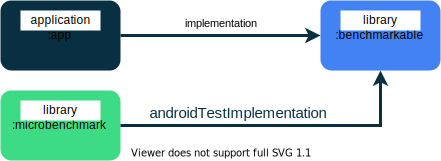

Microbenchmark Sample
===================================

This sample project shows how to use the Jetpack Microbenchmark library.

It includes multiple simple benchmark samples:

* [AutoBoxingBenchmark](microbenchmark/src/androidTest/java/com/example/benchmark/AutoBoxingBenchmark.kt)
  measures the cost of allocating Integer() objects.

* [BitmapBenchmark](microbenchmark/src/androidTest/java/com/example/benchmark/BitmapBenchmark.kt)
  measures the cost of accessing Bitmap pixels, showing the overhead of many JNI calls versus one in
  the underlying Android platform code.

* [SortingBenchmarks](microbenchmark/src/androidTest/java/com/example/benchmark/SortingBenchmarks.kt)
  measures different sorting algorithms, showing how to work with random data
  and `runWithTimingDisabled` sections.

As well as one more complex UI benchmark:

* [RecyclerViewBenchmark](microbenchmark/src/androidTest/java/com/example/benchmark/RecyclerViewBenchmark.kt)
  measures the cost of scrolling a RecyclerView UI defined in another UI library module.

### Project Structure

Microbenchmarks require specific setup to produce consistent results. As a consequence of this, the
project has to be split into several modules:

- `:microbenchmark`- contains only the Microbenchmarks tests.
- `:benchmarkable` - contains the code callable from Microbenchmarks
- `:app` - code within this module can't be called from Microbenchmarks

No Gradle module has dependency on `:microbenchmark` module and therefore it's not merged into the
built application. It serves as an entrypoint to run the benchmark tests from.

### Running

Open the project in Android Studio Arctic Fox 2020.3.1 or later, and run benchmarks as you usually
would run tests: Ctrl-Shift-F10 (Mac: Ctrl-Shift-R)

### Locking Clocks

If you have a rooted device you can benchmark on, use `./gradlew lockClocks` to lock the CPU clocks
of the device to stable values. To unlock clocks, use `./gradlew unlockClocks`, or reboot your
device. This feature is provided by the `androidx.benchmark` gradle plugin.

License
-------

Copyright 2022 The Android Open Source Project, Inc.

Licensed to the Apache Software Foundation (ASF) under one or more contributor license agreements.
See the NOTICE file distributed with this work for additional information regarding copyright
ownership. The ASF licenses this file to you under the Apache License, Version 2.0 (the "License");
you may not use this file except in compliance with the License. You may obtain a copy of the
License at

http://www.apache.org/licenses/LICENSE-2.0

Unless required by applicable law or agreed to in writing, software distributed under the License is
distributed on an "AS IS" BASIS, WITHOUT WARRANTIES OR CONDITIONS OF ANY KIND, either express or
implied. See the License for the specific language governing permissions and limitations under the
License.
