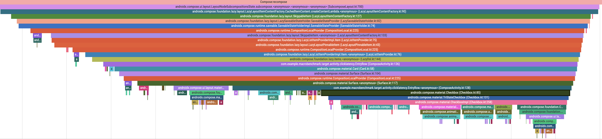

# Macrobenchmark Sample

This sample project shows how to use the Jetpack Macrobenchmark library.

See the [Macrobenchmark guide](https://developer.android.com/studio/profile/macrobenchmark-intro) for more information on the library.

### Code Samples

The sample project includes a variety of benchmarks to help getting started with the API.

Learn about Baseline Profile generation with classes in the
[baselineprofile](macrobenchmark/src/main/java/com/example/macrobenchmark/baselineprofile) folder.

You can also explore [startup](macrobenchmark/src/main/java/com/example/macrobenchmark/startup) and
[frame timing](macrobenchmark/src/main/java/com/example/macrobenchmark/frames) metrics.

Further, the [baseBenchmarks](baseBenchmarks) library offers a drop in benchmarks, which can be
used in production apps to get started with macrobenchmarking.
You can copy & paste the library, then adjust the [package name](baseBenchmarks/src/main/java/com/example/benchmark/macro/base/util/Utils.kt)
to match the app under test and see results quickly.

### Baseline Profiles

Since AGP 8.0.0 Baseline Profiles can be stored in `src/main/baselineProfiles` folder.
This sample uses `src/main/baselineProfiles` to store Baseline Profiles.
With this, more than one profile file can be created, stored and updated.
This makes Baseline Profiles easier to maintain and allows shipping more granular profiles, without
the need to re-generate a full Baseline Profile for minor changes.

Also, baseline profile generators are now in separate classes. One for each user journey and a separate one for app startup.

### Running

Open the `MacrobenchmarkSample` project in Android Studio Bumblebee or later, and run benchmarks as you usually would run tests: Ctrl-Shift-F10 (Mac: Ctrl-Shift-R)

Alternatively, run the benchmarks from terminal with: 
```
./gradlew macrobenchmark:cC
```

### Macrobenchmark with Composition Tracing
Composition Tracing allows to run system tracing with information on when all Composables (re)compose.
This gives you insights on where the UI spends majority of the time and helps you find jank.

To set up composition tracing for your app, follow our [documentation](https://developer.android.com/jetpack/compose/tooling/tracing).
To get composition tracing when running a macrobenchmark, you also need to use `androidx.benchmark.perfettoSdkTracing.enable=true` instrumentation argument.

You can check the `Scroll List With Composition Tracing` run configuration that is part of the project, 
which runs the scroll compose list benchmark while also recording the information on composition.

It produces results like in the following table:
```
FrameTimingBenchmark_scrollComposeList
%EntryRow (%Count                                    min   5.0,   median   6.0,   max   6.0
%EntryRow (%Ms                                       min  10.2,   median  11.8,   max  16.2
EntryRowCustomTraceCount                             min   5.0,   median   6.0,   max   6.0
EntryRowCustomTraceMs                                min  10.0,   median  11.7,   max  16.1

frameDurationCpuMs                                   P50    4.8,   P90    6.8,   P95    8.9,   P99   15.3
frameOverrunMs                                       P50   -9.2,   P90   -1.9,   P95  266.9,   P99  310.9
Traces: Iteration 0 1 2 3 4 5 6 7 8 9
```

And from there you can also delve into the system trace, which shows information on composition: 


### Reporting Issues

You can report an [Issue with the sample](https://github.com/googlesamples/android-performance/issues) using this repository. If you find an issue with the Macrobenchmark library, report it using the [Issue Tracker](https://issuetracker.google.com/issues/new?component=975669&template=1519452).

License
-------

Copyright 2022 The Android Open Source Project, Inc.

Licensed to the Apache Software Foundation (ASF) under one or more contributor
license agreements.  See the NOTICE file distributed with this work for
additional information regarding copyright ownership.  The ASF licenses this
file to you under the Apache License, Version 2.0 (the "License"); you may not
use this file except in compliance with the License.  You may obtain a copy of
the License at

http://www.apache.org/licenses/LICENSE-2.0

Unless required by applicable law or agreed to in writing, software
distributed under the License is distributed on an "AS IS" BASIS, WITHOUT
WARRANTIES OR CONDITIONS OF ANY KIND, either express or implied.  See the
License for the specific language governing permissions and limitations under
the License.
