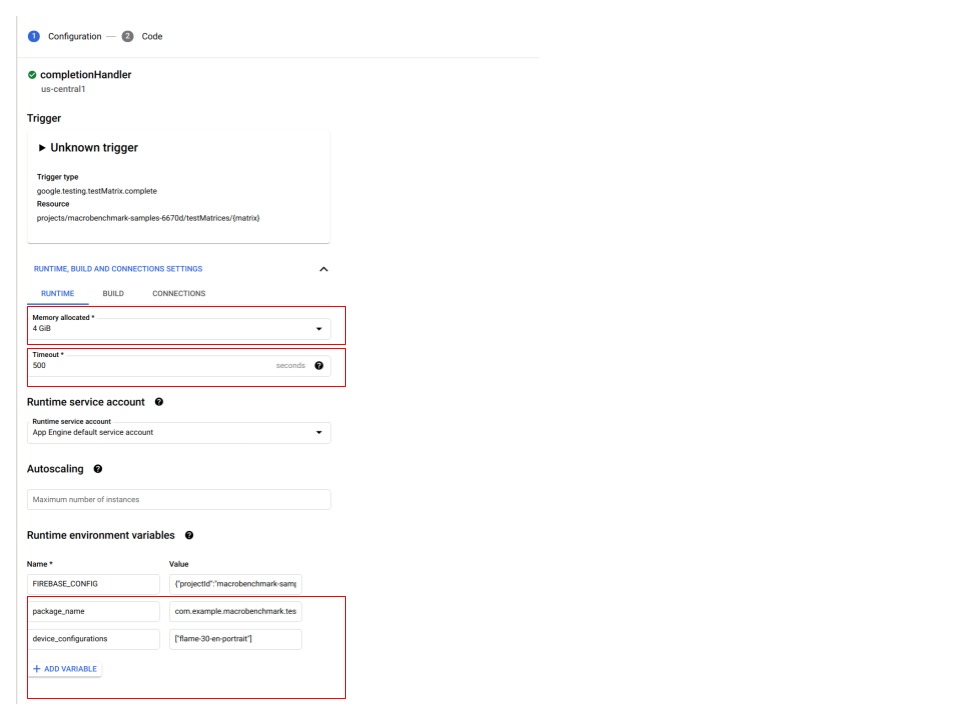
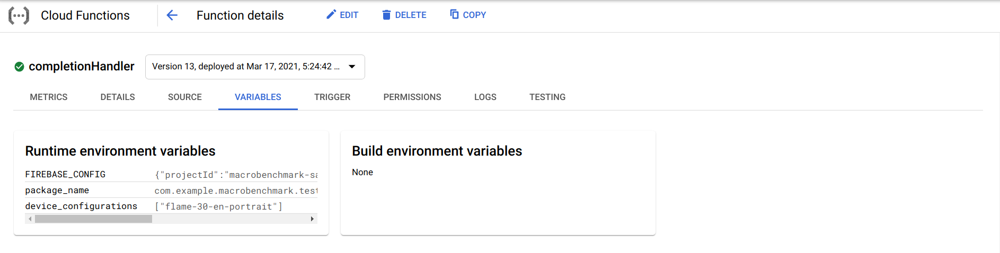
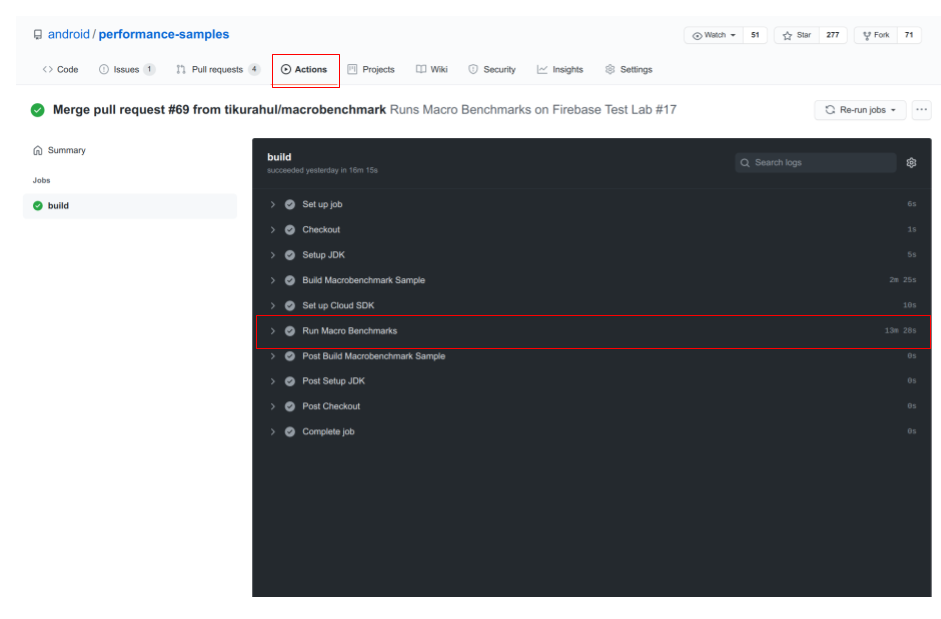
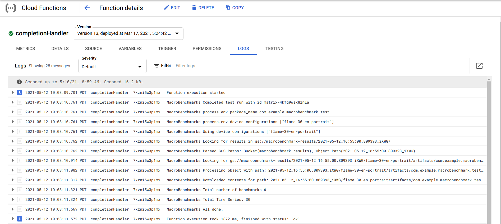
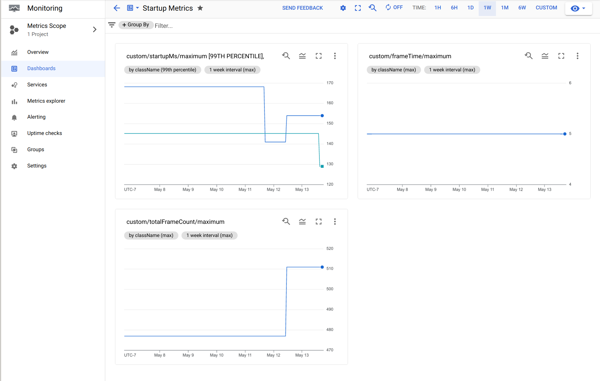
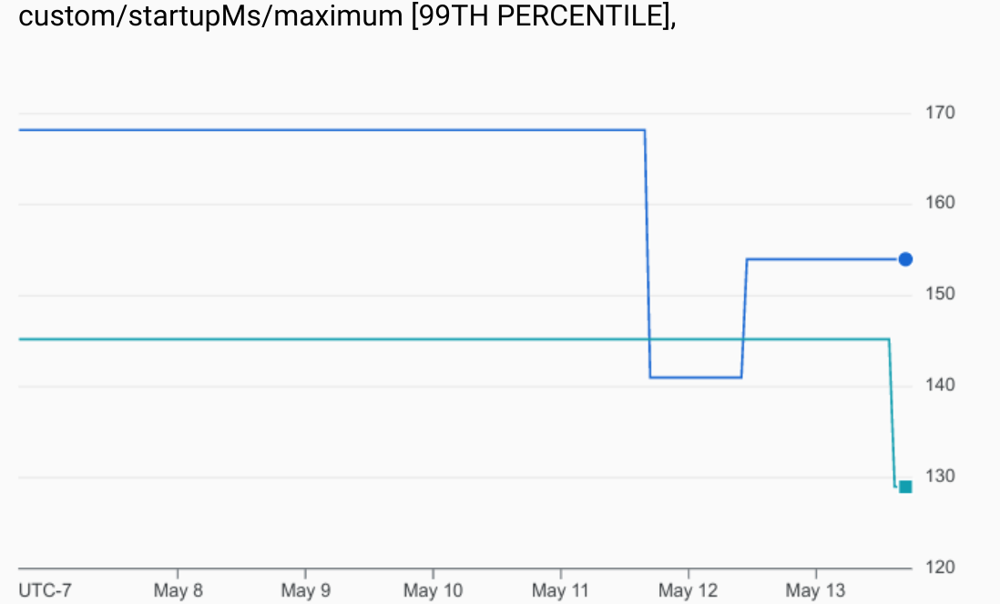

# Setting up Jetpack Macrobenchmarks for CI

This document describes how to use library with Github Actions; running benchmarks on [Firebase Test Lab](https://firebase.google.com/docs/test-lab) and using [Google Cloud Monitoring](https://cloud.google.com/monitoring/docs) to detect regressions, and track app performance over time.

## Overview

To set up Macrobenchmarks on Firebase Test Lab as a `post-submit` action, you will need to configure three components:

1. Github Workflow
  - Builds the app (under test) and the macrobenchmarks.
  - Submits the app APK, and the macrobenchmark APK to Firebase Test Lab.
  
2. A Google Cloud function which automatically pulls results from Firebase Test Lab, and creates custom metrics using Google Cloud Monitoring.

3. Google Cloud Monitoring dashboards
  - Set up custom dashboards
  - Set up alerts

## Project Setup

```
You will need to create a Google Account to setup your Google Cloud Platform project.
```

If you don't have a Firebase project for your app, go to the [Firebase Console](https://console.firebase.google.com/u/0/?pli=1) and click `Create New Project` to create one now. You will need ownership or edit permissions in your project. You might also want to upgrade to the [Blaze plan](https://firebase.google.com/docs/test-lab/usage-quotas-pricing), if you run out of [free quota](https://firebase.google.com/docs/test-lab/usage-quotas-pricing).

### One Time Setup

#### Create Secrets

Create a Google Cloud IAM [service account key](https://cloud.google.com/iam/docs/creating-managing-service-account-keys). This allows your GitHub project to authenticate with the Google Cloud Platform. Store this service account key using [GitHub Secrets](https://docs.github.com/en/actions/reference/encrypted-secrets). 

**Do not** check in this key to your repository, or share with anyone outside your organization.

Create 2 secrets:

* `GCP_PROJECT_ID` represents your Google Cloud Platform `project id`. 
* `GCP_CREDENTIALS` represents the service account key exported to JSON.

Now that you have a service account, you also need to grant the service account access to the Firebase Test Lab APIs. For more information, please refer to [enabling an API for your project](https://cloud.google.com/endpoints/docs/openapi/enable-api).

#### Create a Cloud Storage Bucket

[Create](https://cloud.google.com/storage/docs/creating-buckets) a Google Cloud Storage bucket in your project called `macrobenchmark-results`. This will be the location where the results of test runs from Firebase Test Lab are stored. 

#### Deploy the Google Cloud Function

A [Google Cloud function](https://github.com/android/performance-samples/tree/main/MacrobenchmarkSample/functions) is used to process the results of test runs from Firebase Test Lab, and process the Macrobenchmark results `json` file. The cloud function also captures all the quantitative metrics from the `json` file, and uploads them to Google Cloud Monitoring.

The cloud function uses the [default service account](https://cloud.google.com/functions/docs/securing/function-identity) associated with the Google Cloud Platform project. This service account should be assigned roles that give it access to Google Cloud Storage (so it has access to the created buckets and results stored by Firebase Test Lab), and Google Cloud Monitoring. For more information, please refer to [enabling an API for your project](https://cloud.google.com/endpoints/docs/openapi/enable-api).

### GitHub Workflow

You can create your GitHub workflow, based on [this](https://github.com/android/performance-samples/blob/main/.github/workflows/macrobenchmark.yml) sample.

Let's look at the sample workflow in  more detail, and break it down.


```yaml
name: Build and Run Macrobenchmarks
on:
  push:
    branches: [ macrobenchmark ]
  workflow_dispatch:

jobs:
  build:
    runs-on: ubuntu-latest
    steps:
      - name: Checkout
        uses: actions/checkout@v2
        with:
          fetch-depth: 1
    
      - name: Setup JDK
        id: setup-java
        uses: actions/setup-java@v1
        with:
          java-version: "11"
            
      - name: Build Macrobenchmark Sample
        uses: eskatos/gradle-command-action@v1
        env:
          JAVA_HOME: ${{ steps.setup-java.outputs.path }}
        with:
          arguments: build
          build-root-directory: ${{ github.workspace }}/...
          gradle-executable: ${{ github.workspace }}/.../gradlew
          wrapper-directory: ${{ github.workspace }}/.../gradle/wrapper

      - name: Set up Cloud SDK
        uses: google-github-actions/setup-gcloud@master
        with:
          project_id: ${{ secrets.GCP_PROJECT_ID }}
          service_account_key: ${{ secrets.GCP_SA_KEY }}
          export_default_credentials: true

      - name: Run Macrobenchmarks
        run: |
          gcloud firebase test android run \
            --type instrumentation \
            --app ${{ github.workspace }}/MacrobenchmarkSample/app/build/outputs/apk/benchmark/app-benchmark.apk \
            --test ${{ github.workspace }}/MacrobenchmarkSample/macrobenchmark/build/outputs/apk/benchmark/macrobenchmark-benchmark.apk \
            --device model=redfin,version=30,locale=en,orientation=portrait \
            --directories-to-pull /sdcard/Download \
            --results-bucket gs://macrobenchmark-results \
            --environment-variables additionalTestOutputDir=/sdcard/Download,no-isolated-storage=true \
            --timeout 20m
```

#### Events that trigger the workflow

```yaml
name: Build and Run Macrobenchmarks
on:
  push:
    branches: [ macrobenchmark ]
  workflow_dispatch:
```

This part of the workflow defines the events that trigger a Macrobenchmark run. For our workflow we want to trigger a workflow when a **pull request is merged** or **pushed** to the branch `macrobenchmark`.

#### Building Macrobenchmark Tests

Here we define the jobs that are required to produce the artifacts necessary to kick off a Macrobenchmark run. We need to checkout the source, set up `JDK` and `Gradle` before we can build the Macrobenchmark test APK. Once everything is set up we can run `./gradlew build`.

```yaml
- name: Checkout
  uses: actions/checkout@v2
  with:
    fetch-depth: 1

- name: Setup JDK
  id: setup-java
  uses: actions/setup-java@v1
  with:
    java-version: "11"
      
- name: Build Macrobenchmark Sample
  uses: eskatos/gradle-command-action@v1
  env:
    JAVA_HOME: ${{ steps.setup-java.outputs.path }}
  with:
    arguments: build
    build-root-directory: ${{ github.workspace }}/...
    gradle-executable: ${{ github.workspace }}/.../gradlew
    wrapper-directory: ${{ github.workspace }}/.../gradle/wrapper
```

#### Kick off a Firebase Test Lab Run

Now that the `APK`s are built, we are ready to kick off tests using Firebase Test Lab. For this, we will use the `gcloud` CLI. The CLI will use the GitHub secrets that you previously created to authenticate with Google Cloud Platform. The following GitHub action sets up the `gcloud` CLI. 

```yaml
- name: Set up Cloud SDK
  uses: google-github-actions/setup-gcloud@master
  with:
    project_id: ${{ secrets.GCP_PROJECT_ID }}
    service_account_key: ${{ secrets.GCP_SA_KEY }}
    export_default_credentials: true
```

We can now kick execute tests using Firebase Test Lab with the following job: 

```yaml
- name: Run Macrobenchmarks
  run: |
    gcloud firebase test android run \
      --type instrumentation \
      --app ${{ github.workspace }}/.../benchmark/app-benchmark.apk \
      --test ${{ github.workspace }}/.../macrobenchmark-benchmark.apk \
      --device model=redfin,version=30,locale=en,orientation=portrait \
      --directories-to-pull /sdcard/Download \
      --results-bucket gs://macrobenchmark-results \
      --environment-variables additionalTestOutputDir=/sdcard/Download,no-isolated-storage=true \
      --timeout 20m
```

A couple of important things to keep in mind are:

* We are specifying the type of tests to run (`instrumentation`). 

* We are specifying a device make and model that we are interested in using. Here the `job` wants to use `redfin` (a Pixel 5), API 30. It’s best to run tests against a consistent set of devices so you can compare subsequent runs and set up alerts for regressions.

* We are specifying an environment variable `additionalTestOutputDir` as an argument to the Macrobenchmark Library. This tells the library to store the JSON outputs and associated traces in the external storage directory. These artifacts are eventually copied to the Google Cloud Storage bucket we created. 

* We are specifying a test timeout of 20 minutes. If your tests take longer, choose a longer timeout. 

### Google Cloud Function

The cloud function is notified every time the GitHub `workflow` triggers a Firebase Test Lab run. 
Once a test run is complete, the function processes the resulting JSON file, and uploads all the relevant metrics to Google Cloud Monitoring.

#### One Time Setup

##### Deploying the cloud function

The first step is to deploy the Google Cloud Functions to your GCP project. Make sure you have downloaded the `gcloud` [CLI])(https://cloud.google.com/sdk/gcloud) and the Firebase [CLI](https://firebase.google.com/docs/cli) setup. 

Copy the cloud function from [here](https://github.com/android/performance-samples/tree/main/MacrobenchmarkSample/functions).

Then, initialize your project using the commands below.

```bash
# Initialize gcloud CLI with a GCP admin credentials/
# Will launch a browser and complete an OAuth flow.
gcloud auth login

# Login to firebase using the CLI.
# Will launch a browser and complete an OAuth flow.
firebase login

# Choose a default GCP project
gcloud config set project <your_project_id>
```

Update the `.firebaserc` file with your `project_id`.

```json
{
  "projects": {
    "default": "<your_project_id>"
  }
}
```

Now, deploy the Google Cloud Function.

```bash
# Will deploy the cloud functions for the selected GCP project.
firebase deploy --only functions
```

##### Setting up environment variables

The cloud function uses a couple of environment variables, to determine the `package_name` and the `device_configuration`s. After you `deploy` the cloud function for the first time, you will need to add these environment variables.

To add the variables, go to the [Google Cloud Platform Console](https://console.cloud.google.com) and search for `Cloud Functions`. Then select a function called `completionHandler` and click on `Edit`.

Now click on `Runtime, Build and Connection Settings`. Update the settings to the following:

* Update `Memory allocated` to `4GiB`. 
* Update `Timeout` to `500` seconds.
* Add the following [environment variables](https://cloud.google.com/functions/docs/env-var).

```bash
# The Macrobenchmark target app package name
# Example:
package_name = "com.example.macrobenchmark"
```

```bash
# The device configurations you are interested in tracking metrics for.
# This should match the device that you are testing on in the GitHub workflow.
# Example:
device_configurations = ["redfin-30-en-portrait"]
```




#### Invoking the Cloud Function

The Google Cloud Function deployed should automatically get invoked _after_ a pull request is merged. You can track progress using the GitHub [Actions](https://docs.github.com/en/actions) tab.

[Here](https://github.com/android/performance-samples/actions) is an example.



Once a Firebase Test Lab run is complete, the cloud function will be invoked. Under `Cloud Functions`, when you click on `Logs` you should see something like




### Google Cloud Monitoring

All Macrobenchmark results are stored as [custom metrics](https://cloud.google.com/monitoring/custom-metrics) using Google Cloud Monitoring APIs. These metrics have a namespace `custom.googleapis.com` so you can use the [Metrics Query Editor](https://cloud.google.com/monitoring/mql/query-editor) to query and create dashboards and alerts to catch regressions.

For more information on how you can use the MQL (query language) to create alerts, please refer to the [following documentation](https://cloud.google.com/monitoring/mql/alerts).

#### Monitoring Dashboard



#### Example Metrics


